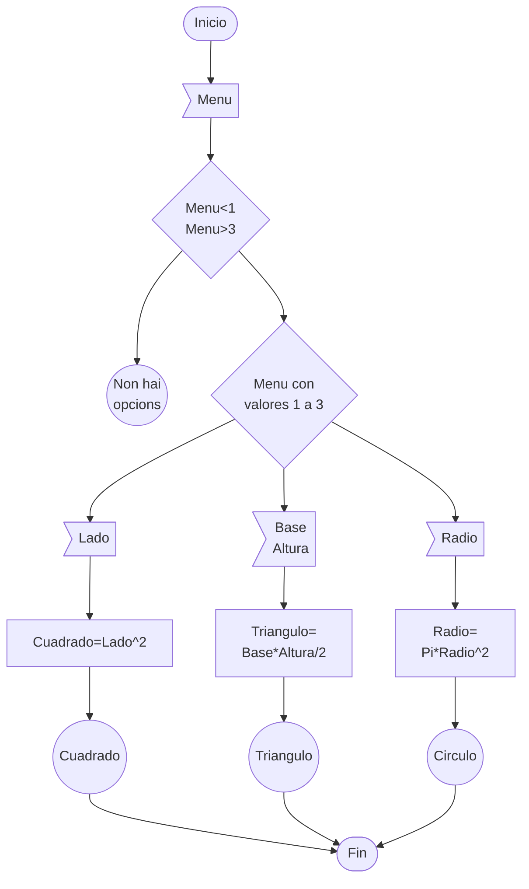

```mermaid
graph TD;
    A([Inicio])-->B>Menu];
    B>Menu]-->C{Menu<1 </br> Menu>3};
    C-->E((Non hai </br> opcions));
    C-->D{Menu con </br> valores 1 a 3};
    D-->F>Lado];
    D-->G>Base</br>Altura];
    D-->H>Radio];
    F-->I[Cuadrado=Lado^2];
    G-->J[Triangulo=</br>Base*Altura/2];
    H-->K[Radio=</br>Pi*Radio^2];
    I-->L((Cuadrado));
    J-->M((Triangulo));
    K-->N((Circulo))
    L-->O([Fin]);
    M-->O;
    N-->O;
```
